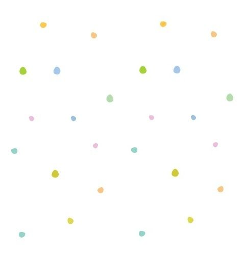
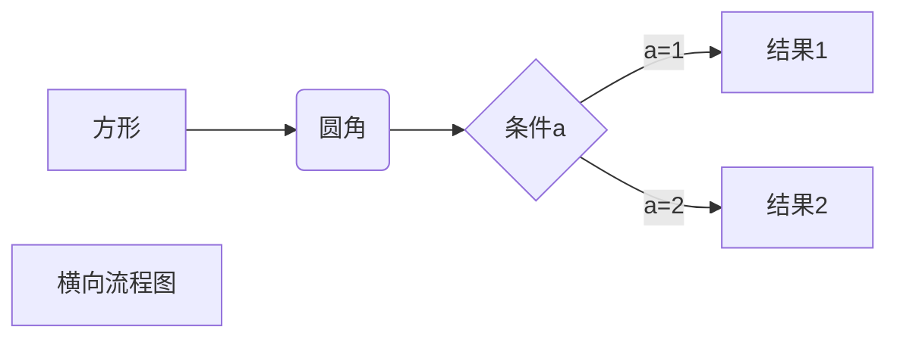

## Gigi的網頁練習
> 練習 HTML、CSS、JS、Bootstrap、Markdown

### 特別功能

|工具|功能|
|:---- |:---- |
|HTML |網頁的骨架|
|CSS |美化網頁 |
|Bootstrap|美化網頁 |
|Markdown|README.md 的編寫 |

```mermaid
    graph LR
    A[方形] -->B(圆角)
        B --> C{条件a}
        C -->|a=1| D[结果1]
        C -->|a=2| E[结果2]
        F[横向流程图]
```

